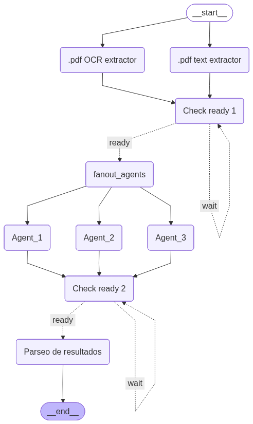

# 🧾 Invoice Parser — LLM Ensemble Agent

An **LLM ensemble system** for automatically extracting fiscal data from PDF invoices. Built with **LangGraph**, it runs multiple agents in parallel over multiple text sources and aggregates their outputs. It processes batches of documents (invoices, debit/credit notes, receipts)
and returns structured JSON per invoice.

---

🎯 What problem does it solve?
Manually entering invoices into an accounting system is slow and error‑prone. This agent automates extraction of all relevant fiscal fields for Argentina (taxable bases by VAT rate, VAT amounts,
perceptions) and verifies that numbers are mathematically consistent before marking them as valid.

## 🏗️ Architecture

<!-- Insert your LangGraph graph image here -->


### How the ensemble works

Each invoice goes through **two independent text extraction methods** (pdfplumber + DocTR OCR), producing two versions of the raw text. Three LLM agents (each with a different temperature) then process both versions independently, yielding **up to 6 parallel extractions per invoice**.

```
1 PDF  →  2 text sources  ×  3 agents  =  6 independent extractions
                                                      ↓
                                             Parse + Normalize
                                                      ↓
                                          [Consensus step — v2]
```

The temperature variation (0.0 / 0.2 / 0.4) introduces controlled diversity in the agents outputs, similar to how ensemble methods in ML use multiple models or random seeds to reduce variance and improve robustness.

---

📊 Output per invoice
``` python
{
  'moneda': 'ARS',
  'confidence': 'high',
  'neto_total': 64236.81,
  'neto_gravado_21': 64236.81,
  'neto_gravado_1050': None,
  'neto_gravado_27': None,
  'no_gravado': None,
  'iva_21': 13489.73,
  'iva_1050': None,
  'iva_27': None,
  'percepciones_iva': None,
  'percepciones_ganancias': None,
  'percepciones_iibb': None,
  'total': 77726.54,
  'errores_validacion': [],
  'valido': True,
  'FileName': '2026-02-01_..._BONVECCHIATO.pdf'
}
```
---


## ✨ Features

- **Dual text extraction**: pdfplumber for embedded-text PDFs + DocTR for spatial OCR
- **LLM ensemble**: 3 agents × 2 text sources = up to 6 extractions per invoice
- **Variable temperature**: controlled output diversity across agents
- **Multimodal agent (Gemini)**: processes the PDF directly as an image, no text extraction needed. (future version: adding a fourth Agent with multimodal LLM)
- **Number normalization**: auto-detects and converts Argentine (`1.234,56`) and US (`1,234.56`) formats
- **Batch processing**: process entire folders
- **Excel export**: direct output to `.xlsx`

---

## 📋 Extracted Fields

| Field | Description |
|---|---|
| `moneda` | Invoice currency (ARS, USD, etc.) |
| `neto_total` | Net subtotal / total before taxes |
| `neto_gravado_21` | Taxable base at 21% VAT rate |
| `neto_gravado_1050` | Taxable base at 10.5% VAT rate |
| `neto_gravado_27` | Taxable base at 27% VAT rate |
| `no_gravado` | Exempt / non-taxable amounts |
| `iva_21` | VAT at 21% |
| `iva_1050` | VAT at 10.5% |
| `iva_27` | VAT at 27% |
| `percepciones_iva` | VAT withholdings |
| `percepciones_ganancias` | Income tax withholdings |
| `percepciones_iibb` | Gross income tax withholdings |
| `total` | Total invoice amount |
| `confidence` | Overall extraction confidence (`high / medium / low`) |

---

## 🛠️ Installation

### Requirements

- Python 3.10+
- [Groq](https://console.groq.com/) account (API key)
- [Google AI Studio](https://aistudio.google.com/) account (API key for Gemini)

### Dependencies

```bash
pip install langchain-core langchain-groq langchain-google-genai
pip install langgraph
pip install pdfplumber
pip install python-doctr[torch]   # or [tf] if you prefer TensorFlow
pip install pandas openpyxl
```

### Configuration

Set your API keys as environment variables:

```bash
export GROQ_API_KEY="your-groq-api-key"
export GOOGLE_API_KEY="your-google-api-key"
```

Then read them in the script:

```python
import os
groq_api_key = os.environ["GROQ_API_KEY"]
google_api_key = os.environ["GOOGLE_API_KEY"]
```

## 🚀 Usage

### Process a single invoice

```python
result = app.invoke({
    "messages": [HumanMessage(content="Extract the data from this invoice:")],
    "pdf_path": "path/to/your/invoice.pdf",
    "agents_config": AGENTS_CONFIG
})

# Export to Excel
df = pd.DataFrame(result["resultados_parseados_etapa2"])
df.to_excel("result.xlsx", index=False)
```

### Batch processing

```python
from pathlib import Path

folder_path = "path/to/invoices/folder"
pdf_files = [str(p) for p in Path(folder_path).glob("*.pdf")]

inputs = [
    {
        "messages": [HumanMessage(content="Extract the data from this invoice:")],
        "pdf_path": pdf_path,
        "agents_config": AGENTS_CONFIG
    }
    for pdf_path in pdf_files
]

results = app.batch(inputs, config={"max_concurrency": 3})
```

---

## 📁 Project Structure

```
invoice-parser/
│
├── facturas_parser.py                      # Main script
├── facturas_parser_system_prompt_v2.txt    # LLM system prompt. (The same system prompt for each agent. Then I will try adding more agents with different roles to improve accuracy in results. )
├── graph.png                               # LangGraph architecture diagram
├── README.md
│
├── invoices/                               # PDF input folder (not included in repo)
│   └── *.pdf
│
└── results.xlsx                            # Generated output (not included in repo)
```

---

## ⚙️ Agent Configuration

```python
AGENTS_CONFIG = {
    "agent_1": {"temperature": 0.0, "prompt_path": "path/to/prompt.txt"},
    "agent_2": {"temperature": 0.2, "prompt_path": "path/to/prompt.txt"},
    "agent_3": {"temperature": 0.4, "prompt_path": "path/to/prompt.txt"},
}
```

Groq models are tried in order, with automatic fallback on rate limit errors:

```python
models = [
    "llama-3.3-70b-versatile",
    "meta-llama/llama-4-scout-17b-16e-instruct",
    "llama-3.1-8b-instant",
    ...
]
```

---

## 📦 Models Used

| Provider | Models | Usage |
|---|---|---|
| Groq | LLaMA 3.3 70B, LLaMA 4 Scout, LLaMA 3.1 8B | Text-based extraction (Agents 1–3) |
| Google Gemini | gemini-2.5-flash | Multimodal extraction directly from PDF (Agent 4) |

🛠️ Stack
Tool             Role
---
LangGraph        Graph‑based agent orchestration
Groq             High‑speed LLM inference
LangChain Core   Message types and abstractions
pdfplumber       PDF text extraction
pandas           Excel export

---

## 🗺️ Roadmap

### v2 — Mathematical Validator & Consensus

The next version will close the ensemble loop with two additions:

**Mathematical validator**: after parsing, each extraction will be checked for internal consistency:
- `iva_21 ≈ neto_gravado_21 × 0.21`
- `iva_1050 ≈ neto_gravado_1050 × 0.105`
- `iva_27 ≈ neto_gravado_27 × 0.27`
- `neto_total ≈ sum of all net components`
- `total ≈ neto_total + all VATs + all withholdings`

Extractions that fail validation will be flagged or discarded before the consensus step.

**Consensus / voting layer**: the 6 validated extractions will be aggregated into a single final result. The planned approach prioritizes mathematically valid extractions and uses majority voting or median values for numeric fields where agents disagree.

---
